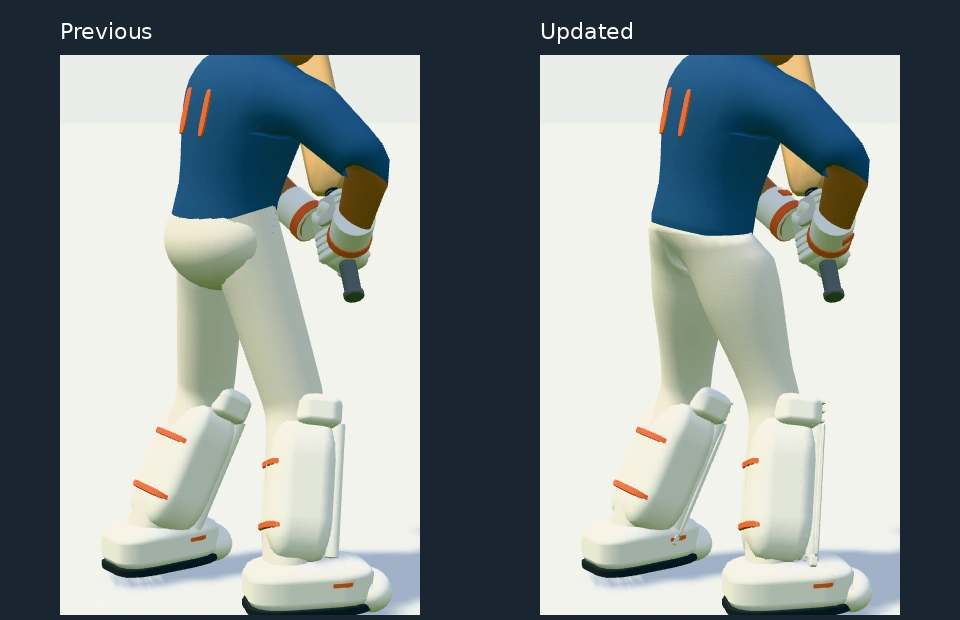
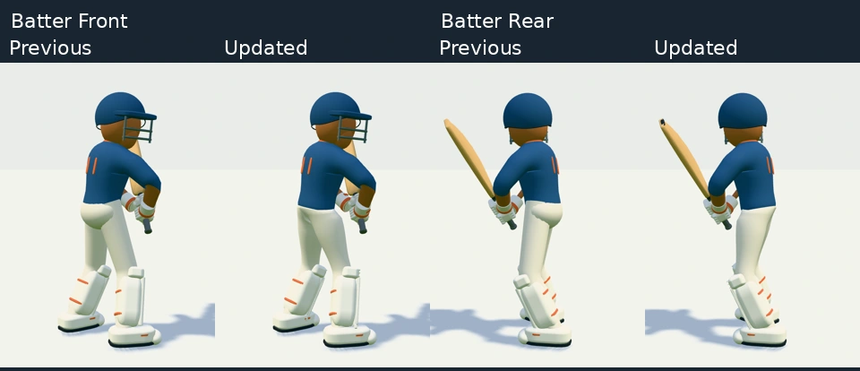
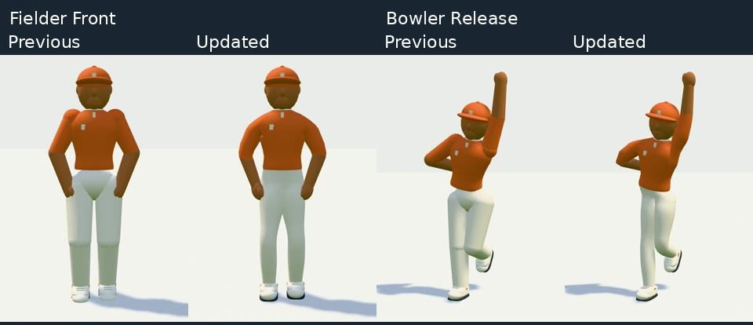

# Character polish — 6 October

Experiment: `codex/graphics-lab-oct05`. Comparison baseline: `91b3897`.

## 1. Batsman silhouette

The rounded hip shell and separate trouser tubes have been replaced by one
connected waist, rise, crotch and leg surface. The waist follows the actual
jersey hem during rotation and bending, so the shirt cannot emerge through a
pelvis-bound waistband. Thighs carry more volume, with a smooth taper into the
knee and calf. The skeleton, standing height and approved shot controls remain
the same. Home-kit trousers remain white; existing alternate kits still work.

## 2. Clothing and equipment

Two shared 64×64 procedural normal textures add subtle weave and willow grain.
They change surface detail without tinting the base material. Mip filtering
reduces distant shimmer; there are no image downloads or per-frame texture
updates. The jersey has a small placket and badge; gloves have cuff detailing;
pads have piping, knee stitching and an ankle flap; shoes have raised laces.
The bat has a face label and toe guard. Rigid details are merged by material.

[Equipment and white-kit views](graphics-lab/equipment-polish.webp).

## 3. Bowler and fielders

They now share the batsman's connected shoulder construction and continuous
trousers. Separate shoulder/elbow/knee balls are hidden rig controls only.
Arm rings are reduced at field distance while retaining shoulder, elbow and
cuff landmarks. Kit switching updates the combined garments as well as the
rigid details, and keeps skin independent of clothing.

## 4. Animation finish

- Subtle breathing and weight shifts while the batsman waits, with feet fixed.
  These fade out during preparation and fade in after shots/celebrations.
- Charge walk-back steps begin at the existing foot positions and close their
  lift arc at each stride boundary. The hips settle to respect leg reach.
- The bowler recovers one foot at a time with pelvis height adjusted for support.
- Fielding shoes stay level when planted, tipping with the shin once lifted.

Shot contact times, authored striking arcs, grip and bowling release timing
are unchanged. Ground, crowd, camera, lighting and colour-grading code are
outside this revision.

## Validation and performance

218 character/animation tests pass, including joined waist edges across shots,
bowling and catches; kit changes; return-step continuity; bowler support; and
the established grip, blade clearance, limb-reach and fielding checks. TypeScript
and the production build pass. Browser captures cover ten character poses and
the gameplay scene with no browser/shader errors.

All six full-game scene cases pass: stadium day/night on desktop and phone,
plus the legacy bowl on desktop and phone. Stadium cases measured 301–347
draw calls including shadow passes, within the lowered 460-call gate; bowl
cases measured 426–485. The first night-phone attempt encountered a menu
transition timing race in the check script. The script now waits for visibility;
that case and the remaining cases pass on rerun.

Matched 600×850 gameplay scene: **211 → 171 draw calls** and **223,410 → 217,822
triangles**. The warmed CPU benchmark for one batsman, one bowler and one fielder
update rises from **0.426 → 0.991 ms** on this headless desktop browser. Continuous
surfaces cost more CPU deformation work while reducing GPU submission and
geometry. These numbers are not a phone FPS measurement.

[Recorded metrics](graphics-lab/character-polish-metrics.json).
`scripts/character-polish-check.mjs` produces the matched captures. Set
`RENDER_PROJECT` to a baseline worktree to compare the same camera and poses;
set `CHROMIUM_PATH` when supplying a custom browser executable.
