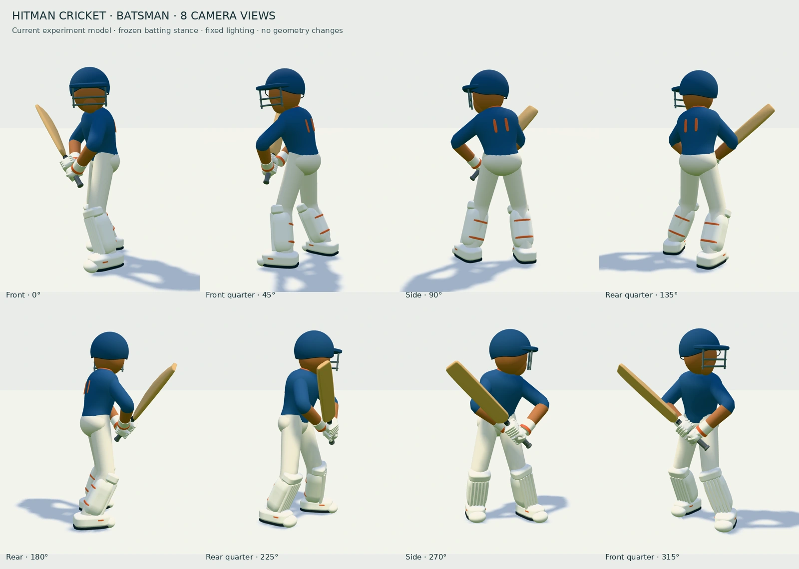
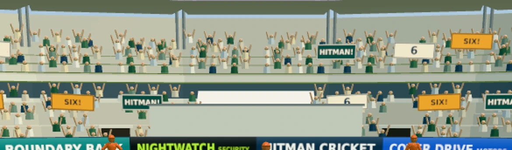

# Crowd celebrations · graphics experiment

Branch: `codex/graphics-lab-oct05`. Production is not changed.

## Batsman snapshots

[Download eight full-size views](batsman-eight-angles.zip). The archive contains
800×1000 WebP images every 45 degrees around the current batsman in his guard.
The camera orbits a centred model against a neutral floor; game lighting and
materials are retained. No model changes or retouching were made for these views.

## Reactions in the stands

| Moment | Spectators and banners | Visual duration | Cheer audio |
| --- | --- | --- | --- |
| Four | Smaller wave of raised arms; 4, FOUR!, CLASS! | 2.4 s | 1.7 s |
| Six | More spectators rise and wave; 6, SIX!, HITMAN! | 3.2 s | 2.8 s |
| Fifty | Broad applause and placards; 50, FIFTY!, HITMAN! | 3.8 s | Existing 2.3 s |
| Century | Full selected crowd reacts; 100, HERO!, TAKE A BOW | 4.8 s | Existing 2.8 s |
| Six sixes | Same larger reaction; 6 x 6, UNREAL!, HITMAN! | 4.8 s | Existing 2.8 s |

Boundary reactions start in `presentResult`, after the outcome is confirmed,
not when the bat hits an airborne ball. Milestones follow the existing
per-batsman detection and celebration timing. A boundary cannot overwrite an
active higher-priority milestone. There is no reaction for dots, singles,
twos or wickets. Existing audio mute/background/pause controls apply to the
reused cheer clip, which has its own channel so impacts do not cut it off.

All moments settle automatically; resetting the scene restores the original
seated matrices and hides placards. Reduced-motion mode uses stationary
raised arms and signs. Banners live in the stands, respect mirrored batting
views, and do not occupy the field or HUD. The legacy `?ground=bowl` retains
its old visual audience; cheer audio still works there.

## Rendering budget and checks

- At most 320 existing spectators animate across the visible far stands.
- Their existing body/head instances are reused. Raised arms add one instanced
  draw; three shared banner textures/materials add three more. Up to 12 banners.
- Idle: 174 phone / 219 desktop draw calls, unchanged. Active: 178 / 223.
- Three 512×192 canvas textures, about 1.5 MiB with mipmaps, created once.
  Only their text is repainted when an event fires. No downloaded assets added.
- No new shadow passes, particles, lights, postprocessing or colour changes.
- `scripts/crowd-check.mjs` exercises the actual Game result/milestone methods,
  negative outcomes, every celebration, reset, priority, reduced motion,
  return to idle draw counts, and phone/desktop browser/shader errors.
- Existing grounds and milestone tests, production build and full-game
  scene checks validate the surrounding flow.

The draw budget is measured in headless Chromium, not real-device FPS.
Sustained phone performance needs playtesting on the same device/resolution.

## Possible follow-up ideas

- A travelling crowd wave for a century, sweeping across the two tiers.
- Small team-colour towels for consecutive boundaries.
- A brief collective lean forward for a near-boundary catch, only once its
  result is revealed so it never gives away an outcome.

These follow-ups are ideas, not part of this revision.
