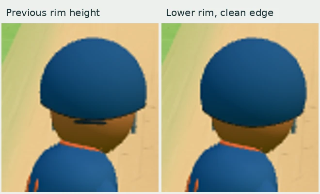
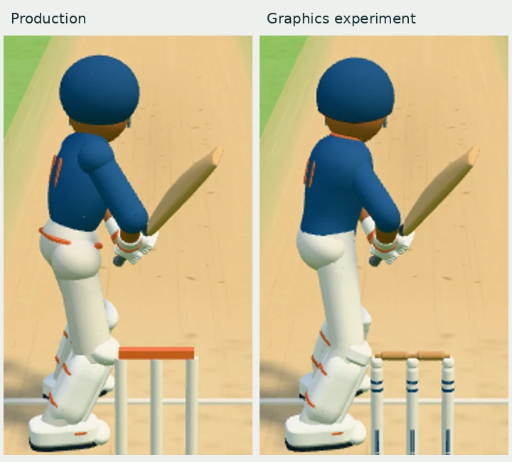
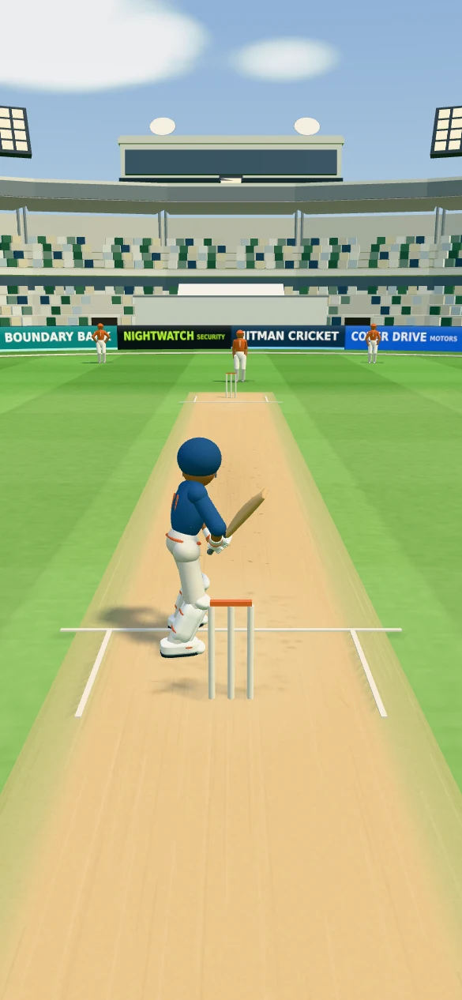
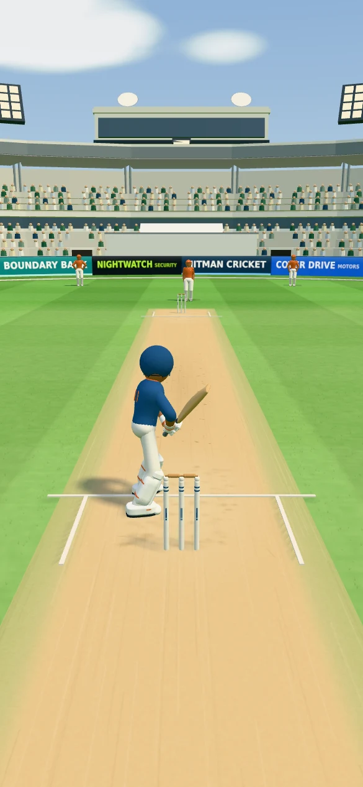

# Graphics experiment · 5 October 2026

Branch: `codex/graphics-lab-oct05`  
Base: production `c42d03c09c78f8798f71164a89996c7de526966f`

This is an isolated, incremental art and rendering experiment on the current
game. It does not change scoring, bowling, shot trajectories, grip poses,
animation timing, the camera/layout, or production deployment configuration.
It retains the procedural rig; it is not a finished Blender/GLB character replacement.

## Visual changes

**Production colour grading is retained exactly.** Lighting, sky generation and
base grass/pitch texture code are byte-identical to production `c42d03c`.
The renderer, exposure, fog, environment settings and stadium palette match
production too. The first experiment's cooler palette has been removed.
`production-look-verification.json` records source comparisons and matched-camera
pixel samples: the sampled sky, dry pitch and stadium roof match exactly.
New geometry naturally has different highlights and shadows.

- The batter has a broader shoulder line, fitted waist, less bulky trouser
  joints, tapered thighs and five pad ribs with a flatter knee roll. White
  trousers are retained. Sleeves and trouser legs now use continuous bending
  surfaces; the separate shoulder, elbow, hip and knee balls are no longer
  rendered. The existing IK controls and shot/contact poses are retained.
- The helmet now has an oval dome, a shallow smile-shaped rear edge, a thin
  edge trim. The rear adjuster has been removed for a clean silhouette. The flat lower wall and bulky side
  blocks have been removed. Rear and side references: [Masuri C-Line](https://www.masuri.com/products/os2-legacy-steel-cricket-helmet)
  and [Masuri E-Line](https://www.masuri.com/products/original-series-mk2-elite-titanium-cricket-helmet).
  Following the latest correction, the back edge dips at the centre and
  rises toward both sides. The previous upward central arch is removed.
  The rear rim has been lowered another 0.025 model metres to cover more
  of the back of the head while retaining some neck clearance.
  Upper thighs are fuller and taper toward the knees, with their roots tucked
  into a slightly broader pelvis. These proportion changes add no geometry,
  draws, materials or animation work.
- Bowler and fielders share the shaped jersey, collar, chest badge and back
  number; the cap and footwear details remain.
- Grass now includes narrow, static blade geometry beside the pitch, fading
  into the flat outfield. It shares the production turf colour map and adds
  one draw call, no wind update and no shadow-map draw. The tiled 256×256
  normal map remains for fine relief; the base colour and mowing pattern
  remain untouched.
- The detailed stumps, turned wooden bails and batched seated crowd remain.
- Shot rigs, contact points, camera and game rules are unchanged.





| Production | Experiment |
| --- | --- |
|  |  |

## Crowd reactions and model views

[Eight-angle batsman snapshots and crowd celebration details](CROWD-CELEBRATIONS.md)
cover the latest addition: confirmed fours/sixes trigger cheers, raised arms
and placards; fifties/hundreds use larger, longer crowd reactions. The table
below remains the idle scene budget. Active reactions add four draw calls
and up to 12,824 rendered triangles; three shared sign textures upload on
first use. They add no idle draws and use the existing cheer audio.

## Rendering budget

Same production source base, camera, pose, viewport, antialiasing, shadow maps
and resolution. These measurements come from a deterministic `GameScene` at
time zero, with no UI. They are **not peak gameplay costs or measured phone FPS**.

| Scene | Draw calls: before → after | Triangles: before → after |
| --- | --- | --- |
| Phone, day · 585×1266 buffer | 242 → 174 (−28.1%) | 207,074 → 206,278 (−0.4%) |
| Phone, night · 585×1266 buffer | 245 → 177 (−27.8%) | 207,076 → 206,280 (−0.4%) |
| Desktop, day · 1280×720 buffer | 326 → 219 (−32.8%) | 273,214 → 226,786 (−17.0%) |

The continuous limb surfaces and removal of visible joint meshes save eight
net draw calls against the preceding preview, including the new grass draw.
Grass uses static geometry and the existing colour map; no additional texture
or postprocessing pass is added in this revision. The retained normal map
uses about 0.33 MiB including mipmaps (8 textures by day, 10 by night before crowd placards first appear).
The four bending surfaces reuse position/normal buffers and scratch vectors;
1,428 vertices are updated per pose. Rigid details and crowd remain batched.
Fewer draws do not establish lower device frame times or GPU memory use.

The attached JSON includes JS submission timings from headless Chromium with
SwiftShader. Those timings are noisy, exclude some asynchronous GPU work,
and must not be interpreted as device frame times or a speedup claim.

Reproduce against a Vite dev server:

```sh
node scripts/graphics-benchmark.mjs http://127.0.0.1:5201 experiment
```

Or set `BENCH_SERVE=1` to start a local Vite child automatically. Set
`CHROMIUM_PATH` if Playwright's default browser is unavailable. Raw outputs
go to `test-results/`; the comparison data is retained in `docs/graphics-lab/`.

## Try it on a phone

Use the **branch preview**, with `?lights=day&perf=1` for daylight and
`?lights=night&perf=1` for floodlights. The readout shows observed render-loop
FPS, P95 frame intervals, draw calls, triangles and pixel ratio once a second.
It performs no network requests. Without `perf=1`, it is not constructed.

Check several innings, special shots, mode changes and sustained play on an
iPhone and Android device before considering a merge. The acceptance goal is
no regression in sustained frame times or batting responsiveness at the same
resolution. Reduced draw counts alone cannot establish that.

Preview Vercel hosts and `perf=1` runs are excluded from analytics. The branch
continues using the repository's existing preview database namespace.

## Validation

The next character-only pass is documented in
[Character polish — 6 October](CHARACTER-POLISH-OCT06.md), with matched renders
and CPU/GPU cost measurements.

- TypeScript and production build, including serverless function import checks.
- Latest helmet curve: build and 5 geometry/batching tests passed, with
  day/night phone and desktop renders free of browser/shader errors.
  Draw calls are unchanged; removing the adjuster saves 300 rendered triangles.
- Preceding neck/thigh refinement: 145 batter and geometry tests passed;
  deterministic phone day/night and desktop captures retain the same render counts.
- 213 batter, bowler, fielder and geometry tests passed for this revision,
  including connected limb surfaces and helmet rim/outward-normal checks.
  The preceding colour restoration also passed the grounds, lighting and
  analytics checks.
- Deterministic day/night/desktop captures with no shader or browser errors.
- Full-game scene checks exercise the actual cover → mode → innings flow.
  All stadium cases remain within the 500-call regression budget, lowered
  from production's 680 calls per frame.

No production branch was pushed, merged or redeployed for this experiment.

## Stump code handoff

Raised-arm sleeve coverage was subsequently corrected; see
[the original gap fix](SHOULDER-FIX.md) and the subsequent
[connected shoulder shape and matched renders](SHOULDER-SHAPE.md).

`stump-update.zip` includes the current `wicket.ts`, its `build.ts` helper,
and integration instructions. The existing bail animation/reset origins
remain unchanged. The package is also usable independently of this character
and grass revision.
