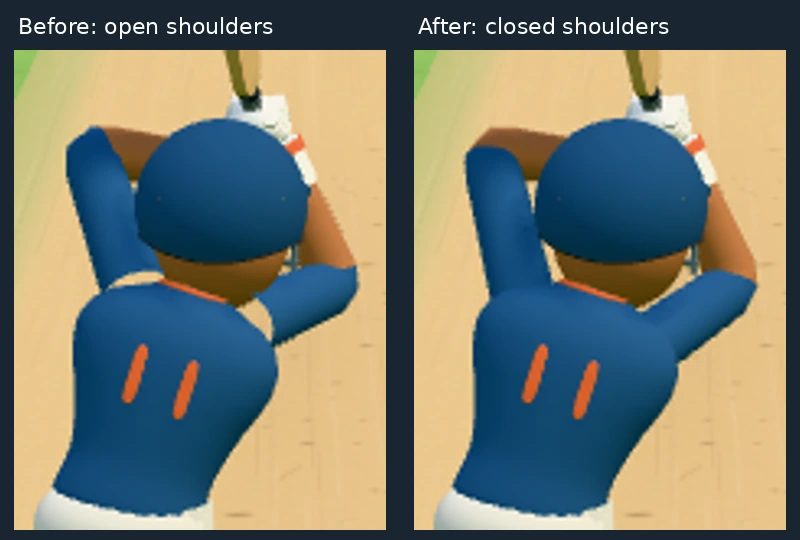
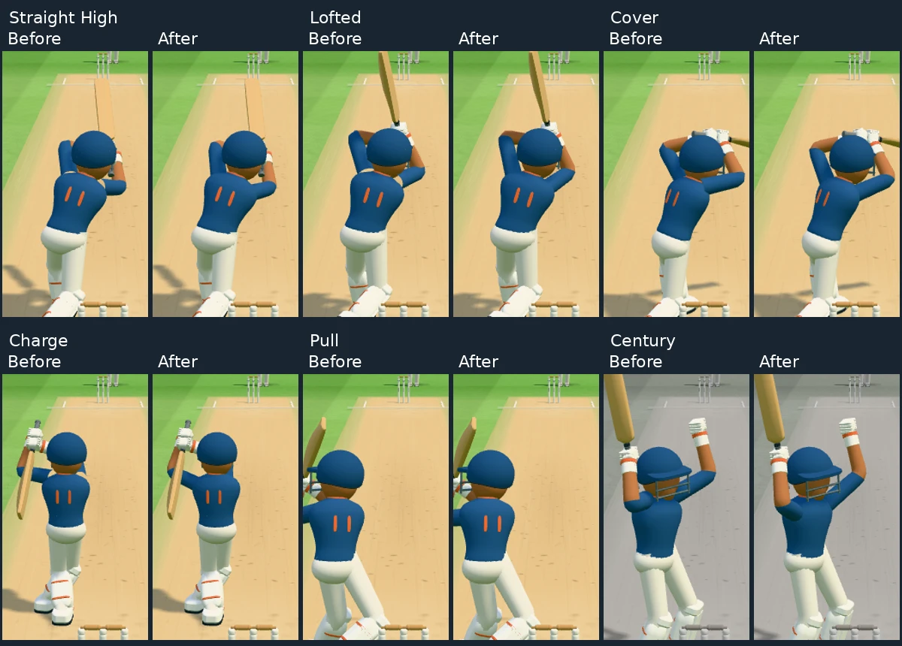

# Raised-arm shoulder coverage

The pitch was visible through the jersey at the sleeve roots during raised-arm
shots. The previous root followed the lifted IK shoulder, leaving part of each
open sleeve ring outside the jersey's sloping shoulder surface.

Both sleeve roots now remain inside the torso, in its local coordinate frame.
The existing sleeve deformation still follows the elbows and wrists. Shot
timing, hand targets, bat grip, lighting and colour settings are unchanged.
No joint spheres, extra meshes or double-sided game materials were added.

## Validation

- The new coverage test fails on the previous attachment and passes with the fix.
  It checks every sleeve-root vertex against the actual jersey geometry through
  shot directions, ball heights and lateral offsets, charge, loft, sweep, flat
  shots, defence, and both milestone animations. It requires overlap clearance.
- 146 batter, bending-limb and graphics-part tests passed, including coverage.
- TypeScript and production build passed.
- Seven deterministic phone renders had no browser or shader errors.
  Before and after both render 174 calls and 206,278 triangles in these scenes.
  This verifies unchanged geometry cost, not a new sustained-device FPS claim.

Reproduce coverage with `npx vitest run tests/shoulder-coverage.test.ts`.
Render comparisons with `node scripts/shoulder-check.mjs before` and
`node scripts/shoulder-check.mjs after`; set `CHROMIUM_PATH` if using a custom
browser executable. The before mode restores only the old sleeve attachment
at runtime, so each pair uses the same scene and pose. Captures go into
`test-results/shoulders`.

The fix is confined to `codex/graphics-lab-oct05`.
