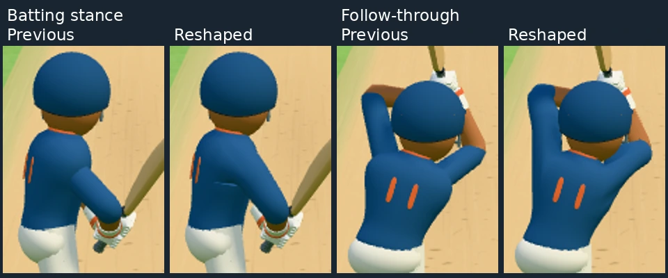
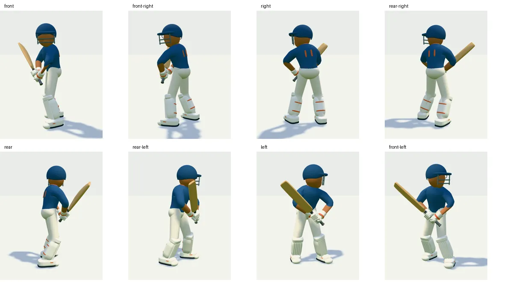

# Connected shoulder and arm shape

The preceding sleeve-root overlap closed the pitch gaps but left an abrupt,
narrow arm emerging from the chest. The batter now has one indexed surface
from torso through shoulder and underarm to both arms. Shared shoulder vertices
and smoothed normals replace the overlapping meshes. The upper arm is fuller;
there are no visible ball joints. Elbow/wrist targets, shot poses, bat grip,
height, kit colours and scene lighting are unchanged.

`ConnectedJersey.ts` removes the torso's side panels and joins each opening to
the upper arm through three intermediate rings. The transition leaves the torso
along its surface and meets the arm's direction. Torso, shoulders and arms share
indices and area-weighted normals. Position and normal arrays are reused each
frame. `BendingLimb` still follows the established IK chain; its arm buffers are
now inputs to the garment rather than separately drawn meshes. Trouser limbs
retain their existing geometry.

## Verification and cost

- 146 batter, limb, graphics-part and shoulder tests pass. The shoulder test
  verifies joined edges and finite geometry across shot directions, ball heights,
  lateral offsets, charge, loft, sweep, defence and milestone poses. Only the
  collar, waist and wrist ends have open boundary edges.
- TypeScript and production build pass. The first parallel run passed all tests
  but reported a Vitest RPC timeout; a single-worker rerun completed cleanly.
- Eight phone poses and eight model angles render without browser errors.
- Matching phone scenes: 174 → 171 draw calls, 206,278 → 206,006 triangles.
- Warmed headless-browser median CPU time per `Batter.update`: 0.134 → 0.347 ms.
  This is about 0.21 ms extra CPU for surface deformation and shared normals,
  with less GPU submission work. It is not an on-device FPS measurement.

See [recorded metrics](graphics-lab/shoulder-shape-metrics.json).
Use `node scripts/shoulder-check.mjs before` for the preceding overlap model and
`node scripts/shoulder-check.mjs connected` for the current surface. The before
mode reconstructs the preceding torso and sleeve geometry at runtime in the
same scene. Set `CHROMIUM_PATH` when using a custom Chromium executable.

Experiment branch only: `codex/graphics-lab-oct05`. No production ref is updated.
